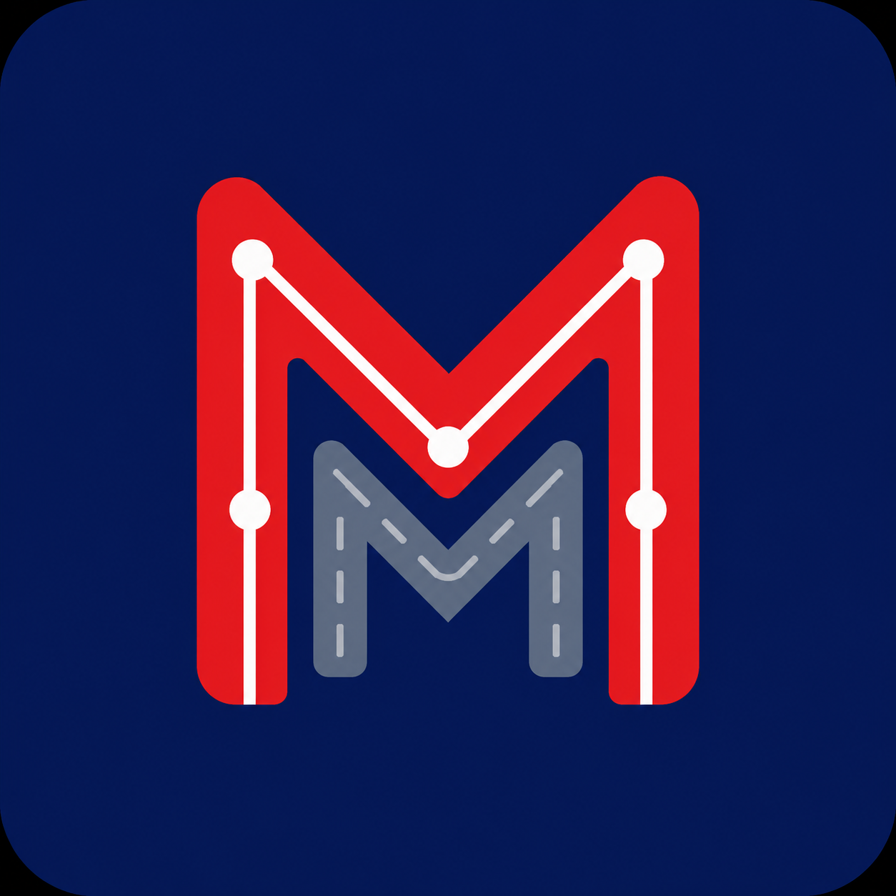

  

<h1 align="center">MetroMile 🚇🏃‍♂️</h1>

  <strong>La red social deportiva global donde conquistas las líneas de transporte de tu ciudad vinculando tu Strava.</strong>

  <a href="https://metromile-run.vercel.app/"><strong>🔗 ¡Prueba la App Aquí! (metromile-run.vercel.app)</strong></a>

  <a href="#-cómo-instalar-la-app-en-tu-móvil-o-pc">Instalar App</a> •
  <a href="#-características-principales">Características</a> •
  <a href="#-sistema-de-medallas-y-logros">Medallas</a> •
  <a href="#-seguridad-ante-todo">Seguridad</a>

---

## 🏃‍♀️ ¿Qué es MetroMile?

¿Te gusta correr por la ciudad? ¿Te conoces las líneas de metro y autobús de memoria? **MetroMile** es una **red social deportiva** que convierte tus entrenamientos urbanos en retos de transporte colectivos. 

El funcionamiento es muy sencillo: **elige una línea de metro, tranvía o autobús de tu ciudad y complétala recorriendo su trazado de parada a parada.** Sincroniza tus actividades vinculando tu cuenta de **Strava** y compite con una comunidad global de atletas urbanos para ascender desde *Transeúnte* a la categoría de *Leyenda del Tránsito*.

---

## 📲 ¡Pruébalo ahora! Cómo instalar la app en tu móvil o PC

No necesitas registrarte en Google Play ni App Store ni realizar descargas complejas. MetroMile funciona como una Aplicación Web Progresiva (PWA) instalable directamente desde tu navegador de internet.

### Sigue estos pasos para instalarla:
1. **Accede a la aplicación haciendo clic en el siguiente enlace:**  
   👉 [**https://metromile-run.vercel.app/**](https://metromile-run.vercel.app/)
2. **Instálala en tu pantalla de inicio en segundos:**
   * **En iPhone / iPad (Safari):** Pulsa el botón **Compartir** (el icono del cuadrado con la flecha hacia arriba) y selecciona **"Añadir a pantalla de inicio"**.
   * **En Android (Chrome):** Pulsa los tres puntos de la esquina superior derecha y selecciona **"Instalar aplicación"** o **"Añadir a pantalla de inicio"**.
   * **En Ordenador (Chrome/Edge):** Haz clic en el icono de instalación (una pequeña pantalla con una flecha) que aparece en la barra de direcciones para usarla como una app de escritorio independiente.
3. ¡Listo! Ya puedes abrirla a pantalla completa y sincronizar tus entrenamientos.

---

## 🌟 Características Principales

* **🔌 Conexión Directa con Strava:** Vincula tu cuenta de Strava en un solo clic desde los Ajustes. Tus entrenamientos GPS se sincronizarán en segundo plano de forma instantánea para validar qué líneas de transporte has completado.
* **🗺️ Retos de Transporte Real:** Elige tu ciudad, selecciona una línea de transporte y recórrela. La app analizará las paradas por las que has pasado para calcular el porcentaje de coincidencia.
* **🔊 Sonidos Temáticos Inmersivos:** La app incluye efectos de audio retro sintetizados (bocinas de autobuses, cláxones de trenes, chirridos metálicos de metro en curvas y liberación de aire neumático de frenos). Puedes desactivarlos o testearlos en tu panel de pruebas de Ajustes.
* **🎫 Billete Diario de la Suerte:** Valida tu billete digital una vez al día para conseguir bonificadores de experiencia (XP) y multiplicadores para tus carreras. Disfruta de la animación con vibración física y estallido de partículas doradas o esmeraldas.
* **📸 Feed Social y Personalización:** Comparte tus trayectos con tus seguidores en el feed público. Puedes personalizar tus entrenamientos editando el título, añadiendo una descripción de cómo te has sentido y subiendo tus propias fotos o fondos temáticos de transporte.
* **⭐ Atletas Favoritos:** Sigue a tus amigos de entrenamiento y recibe notificaciones especiales con sonidos de campana brillante cuando registren una línea completada.

---

## 🎖️ Sistema de Medallas y Logros

Completa retos especiales para ganar insignias exclusivas en tu perfil:
* **🥇 Medallas por Ritmo:** Consigue medallas de oro, plata o bronce según tu ritmo medio en cada línea de transporte.
* **🌙 Vigilante Nocturno:** Completa cualquier línea corriendo en horario nocturno (entre las 22:00 y las 6:00).
* **⚡ Tren Expreso:** Completa un trayecto a una velocidad promedio de carrera por debajo de 4:30 min/km.
* **🛂 Pasaporte Dorado:** Conquista y valida al menos una línea de transporte en 3 ciudades del mundo diferentes.

---

## ⚠️ Seguridad Ante Todo

> [!IMPORTANT]
> **MetroMile es una red social de running urbano sobre la superficie.** 
> Bajo ninguna circunstancia debes acceder a túneles de metro, vías de tren activas, autopistas o zonas restringidas de tránsito. Todos los retos deben completarse utilizando exclusivamente las aceras, pasos de peatones y vías públicas seguras destinadas a los peatones. ¡Corre con cabeza!
